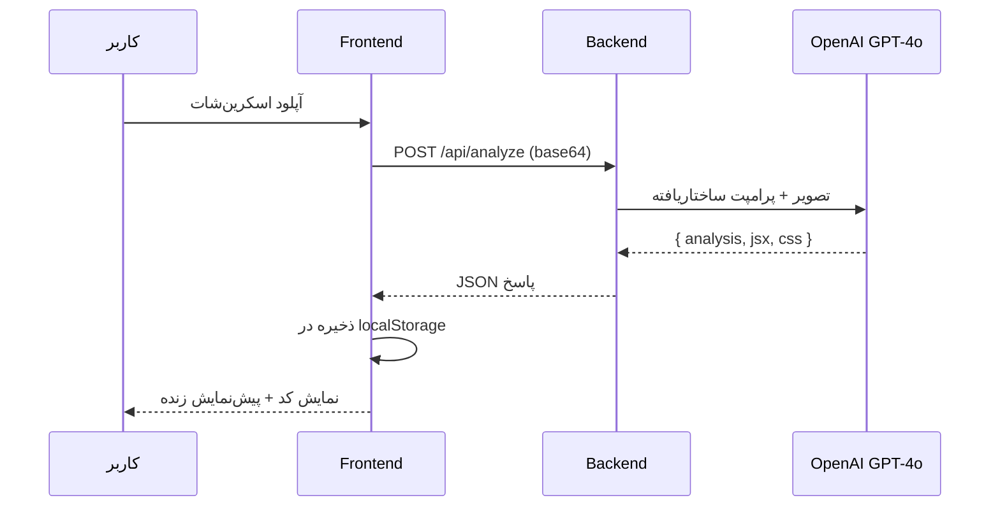

<div align="center">

# 🧬 UI Cloner

### از عکس تا کد — در چند ثانیه

یه اسکرین‌شات از هر رابط کاربری بده (مثلاً گیت‌هاب)، هوش مصنوعی تحلیلش می‌کنه و کد **React** واقعیش رو با **پیش‌نمایش زنده** تحویلت می‌ده.

[](#)
[](#)
[](#)
[](#)
[](#)
[](#)

</div>

---

## ✨ ویژگی‌ها

| | |
|---|---|
| 📸 **آپلود با Drag & Drop** | عکس رو بکش و رها کن، همین |
| 🧠 **تحلیل با GPT-4o Vision** | رنگ‌ها، فاصله‌ها، تایپوگرافی و ساختار لایه رو تشخیص می‌ده |
| ⚛️ **خروجی React واقعی** | نه توضیح، نه نیمه‌کاره — کد کامل JSX + CSS |
| 👁️ **پیش‌نمایش زنده** | همون لحظه کد تولیدشده رو اجرا و رندر می‌کنه |
| 🕘 **تاریخچه** | همه‌ی کلون‌های قبلی‌ت لوکال ذخیره می‌شن |
| 🔒 **کلید API امن** | فقط روی بک‌اند، هیچ‌وقت توی مرورگر لو نمی‌ره |

---

## 🏗️ معماری

```
┌─────────────┐         base64 image          ┌──────────────┐        vision + json         ┌───────────┐
│  Frontend   │ ─────────────────────────────► │   Backend    │ ────────────────────────────► │  OpenAI   │
│ React + Vite│                                 │Express + SDK │                                │  GPT-4o   │
│             │ ◄───────────────────────────── │              │ ◄──────────────────────────── │           │
└─────────────┘        { analysis, jsx, css }   └──────────────┘        structured JSON         └───────────┘
```

```
github-ui-cloner/
├── backend/                 # 🔧 Express server — پراکسی امن به OpenAI
│   ├── server.js            #    POST /api/analyze
│   └── .env.example
│
└── frontend/                # 🎨 React + Vite + React Router
    └── src/
        ├── pages/
        │   ├── Home.jsx      # آپلود و شروع تحلیل
        │   ├── Result.jsx    # کد + پیش‌نمایش زنده
        │   └── History.jsx   # تاریخچه‌ی کلون‌ها
        ├── components/
        │   ├── Dropzone.jsx
        │   ├── CodeViewer.jsx
        │   └── PreviewFrame.jsx
        └── api.js
```

---

## 🚀 شروع سریع

### پیش‌نیاز
- Node.js نسخه‌ی ۱۸ یا بالاتر
- یه [کلید OpenAI API](https://platform.openai.com/api-keys)

### ۱) بک‌اند رو بالا بیار

```bash
cd backend
npm install
cp .env.example .env      # کلید OPENAI_API_KEY رو داخلش بذار
npm run dev
```

> 🟢 سرور روی `http://localhost:8787` گوش می‌ده

### ۲) فرانت‌اند رو بالا بیار

```bash
cd frontend
npm install
cp .env.example .env
npm run dev
```

> 🟢 اپ روی `http://localhost:5173` در دسترسه

### ۳) امتحانش کن
یه اسکرین‌شات از یه صفحه‌ی گیت‌هاب بگیر، توی صفحه‌ی خانه رهاش کن، دکمه‌ی «تحلیل و تولید کد» رو بزن و چند ثانیه بعد کد + پیش‌نمایش زنده‌ش رو ببین. 🎉

---

## 🔄 جریان کار



---

## 🛠️ استک فنی

- **Frontend:** React 18 · React Router 6 · Vite 5
- **Backend:** Express 4 · OpenAI SDK
- **مدل هوش مصنوعی:** `gpt-4o` (vision + `response_format: json_object`)
- **پیش‌نمایش زنده:** Babel Standalone داخل `iframe` سندباکس‌شده

---

## ⚠️ نکات مهم قبل از Production

- [ ] نتایج رو به‌جای `localStorage` توی یه دیتابیس واقعی (Postgres / SQLite) ذخیره کن
- [ ] Rate limiting و احراز هویت اضافه کن — هر تحلیل هزینه‌ی API داره
- [ ] برای پاسخ‌های نامعتبر JSON از مدل، retry logic بذار
- [ ] `.env` واقعی رو هیچ‌وقت commit نکن (توی `.gitignore` پوشش داده شده)

---

<div align="center">

ساخته‌شده با ❤️ و کلی فنجون قهوه ☕

</div>