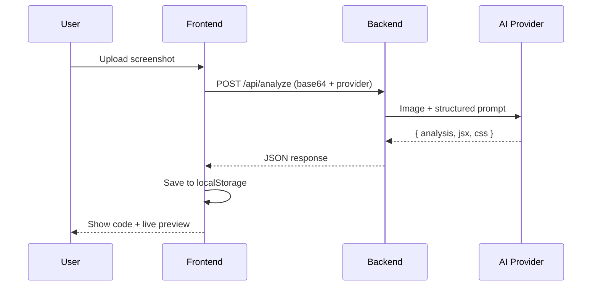

<div align="right">

**🌐 [فارسی](./README.fa.md) | English**

</div>

<div align="center">

# 🧬 UI Cloner

### From Screenshot to Code — in seconds

Upload a screenshot of any UI (like GitHub), and the AI analyzes it and hands you back real **React** code with a **live preview**.

[](#)
[](#)
[](#)
[](#)
[](#)
[](#)

</div>

---

## ✨ Features

| | |
|---|---|
| 📸 **Drag & Drop Upload** | Just drag your screenshot in |
| 🧠 **Multi-provider AI analysis** | Switch between OpenAI, Z.AI, or Anthropic — whichever key you have |
| ⚛️ **Real React output** | Not a description — full working JSX + CSS |
| 👁️ **Live preview** | Renders the generated code instantly |
| 🕘 **History** | Every past clone saved locally |
| 🌐 **Bilingual UI** | English / Persian, switchable in the navbar |
| 🔒 **API keys stay server-side** | Never exposed to the browser |

---

## 🏗️ Architecture

```
┌─────────────┐         base64 image          ┌──────────────┐        vision + json         ┌─────────────────────┐
│  Frontend   │ ─────────────────────────────► │   Backend    │ ────────────────────────────► │  OpenAI / Z.AI /     │
│ React + Vite│                                 │Express + SDK │                                │  Anthropic (vision)  │
│             │ ◄───────────────────────────── │              │ ◄──────────────────────────── │                       │
└─────────────┘        { analysis, jsx, css }   └──────────────┘        structured JSON         └─────────────────────┘
```

```
github-ui-cloner/
├── backend/                 # 🔧 Express server — secure proxy to the AI provider
│   ├── server.js            #    POST /api/analyze · GET /api/providers
│   ├── providers.js         #    OpenAI / Z.AI / Anthropic config
│   └── .env.example
│
└── frontend/                # 🎨 React + Vite + React Router
    └── src/
        ├── pages/
        │   ├── Home.jsx      # Upload + analyze
        │   ├── Result.jsx    # Code + live preview
        │   └── History.jsx   # Past clones
        ├── components/
        │   ├── Dropzone.jsx
        │   ├── CodeViewer.jsx
        │   ├── PreviewFrame.jsx
        │   └── Navbar.jsx     # nav + language switch + backend status
        ├── i18n/translations.js
        ├── context/LanguageContext.jsx
        └── api.js
```

---

## 🚀 Quick Start

### Prerequisites
- Node.js 18+
- An API key for at least one provider: [OpenAI](https://platform.openai.com/api-keys), [Z.AI](https://z.ai/model-api), or [Anthropic](https://console.anthropic.com/)

### 1) Start the backend

```bash
cd backend
npm install
cp .env.example .env      # add whichever provider key(s) you have
npm run dev
```

> 🟢 Server listens on `http://localhost:8787`

### 2) Start the frontend

```bash
cd frontend
npm install
cp .env.example .env
npm run dev
```

> 🟢 App available at `http://localhost:5173`

### 3) Try it out
Drop a screenshot of a GitHub page onto the home page, hit **Analyze & Generate Code**, and a few seconds later you'll have working React code and a live preview. 🎉

---

## 🔄 How it works



---

## 🌍 Supported AI Providers

| Provider | Env var | Default model |
|---|---|---|
| OpenAI | `OPENAI_API_KEY` | `gpt-4o` |
| Z.AI | `ZAI_API_KEY` | `glm-4.6v` |
| Anthropic | `ANTHROPIC_API_KEY` | `claude-sonnet-4-6` |

You only need to configure the ones you plan to use — the app auto-detects available providers and lets you pick one in the UI.

---

## 🛠️ Tech Stack

- **Frontend:** React 18 · React Router 6 · Vite 5
- **Backend:** Express 4 · OpenAI-compatible SDK (works across all 3 providers)
- **Live preview:** Babel Standalone inside a sandboxed `iframe`
- **i18n:** Custom lightweight context-based translation, EN default / FA toggle

---

## ⚠️ Before going to production

- [ ] Persist results in a real database (Postgres / SQLite) instead of `localStorage`
- [ ] Add rate limiting and authentication — every analysis costs API credits
- [ ] Add retry logic for invalid JSON responses from the model
- [ ] Never commit your real `.env` (already covered by `.gitignore`)

---

<div align="center">

Built with ❤️ and a lot of coffee ☕

</div>